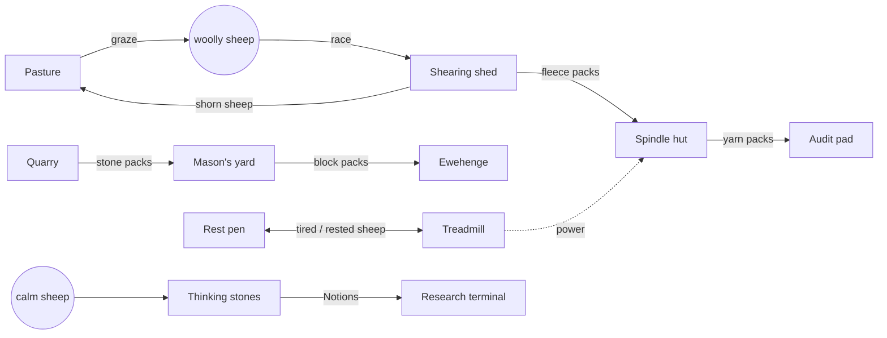

# AUTOSHEEP — Game Design Document

*Version 0.1 · living document*

> **Autosheep** is an isometric pixel-art automation game. In Factorio you build conveyor belts;
> here the belts are sheep. As General Gafoop, an alien warlord exiled on Earth by his own
> paperwork, you must herd the planet's sheep from the Stone Age to the Industrial Age. The
> trouble is that sheep are, and remain, sheep.

| | |
|---|---|
| Genre | Automation / factory-builder with a living logistics layer (flocking sheep) |
| Camera | Isometric 3D rendered as pixel art (orthographic, 4 rotations) |
| Platform | Web first (desktop browsers, WebGL2). Desktop builds via Electron or Tauri later |
| Stack | TypeScript, three.js, Vite. Flock sim in Web Workers |
| Tone | Futurama, Rick and Morty, The Hitchhiker's Guide to the Galaxy: dry, absurd, warm |
| Comparables | Factorio, Satisfactory, Shapez, Dyson Sphere Program; for flocks: Tiny Glade's gentleness, Untitled Goose Game's slapstick |
| Status | M0 done (intro, pixel pipeline). M1 playable: one level, herd 30 sheep into a pen |

Related documents:

- [`research/pixel-art-rendering.md`](research/pixel-art-rendering.md): the 3D→pixel-art pipeline research.
- [`research/sheepherding-repo-analysis.md`](research/sheepherding-repo-analysis.md): a snapshot analysis of the `sheepherding` flock sim and a proposed architecture for map-scale flocks. The flock model is a work in progress; the game depends on it only through the contract in §4.1.
- Intro cutscene source: `src/intro/` (script in `src/intro/lines.json`, edit decision list in `src/intro/timeline.ts`).

---

## 1. Vision

### 1.1 The pitch in one paragraph

Aliens invaded Earth and, by an honest bureaucratic mistake, wiped out the humans while
sparing the sheep. Galactic law says an invader may exterminate any species *except the dominant
one*. The invasion is therefore illegal unless the sheep turn out to be more advanced than the
humans were. General Gafoop has been exiled to Earth until they are. You cannot teach a sheep
anything. But you **can** build fences, gates, races, gongs, clockwork collies, treadmills, mills and
railways, and arrange them so cleverly that a civilisation happens *around* the sheep. Sheep walk
through your systems, and wool, stone, bronze, iron and steam come out the other end. The sheep
never notice.

### 1.2 Design pillars

1. **Sheep are sheep.** Sheep never become smart, never talk, never "understand" a task. All the
   intelligence in the game lives in the player's infrastructure. Every sheep behaviour comes
   from a real flocking model (fear, following, bunching, grazing, panic). The comedy depends on
   this rule never breaking.
2. **The belts are alive.** Logistics is herding. Throughput, jams, leaks and failures come from
   flock behaviour, not from abstract rules. A well-designed herdway feels like a perfect belt. A
   bad one produces a stampede, and that should be funny, not punishing.
3. **Real livestock science, silly consequences.** Every routing rule is a real handling
   principle: flight zones, point of balance, curved races, avoiding shadows and dead ends,
   follow-the-leader. Players who learn the game learn something true about sheep.
4. **Bureaucracy is the boss fight.** Progress is measured by **Audits** from the Galactic
   Bureau of Conquest. You fill in forms, file milestones and appeal rulings. The Universal
   Almanac of Regrettable Decisions narrates it all with a straight face.
5. **A diorama you want to stare at.** Pixel-perfect isometric art and readable motion: a
   factory of a thousand sheep should look like a living tapestry, not spreadsheet noise.

### 1.3 What makes it different from Factorio

| Factorio / Satisfactory | Autosheep | Why it is interesting |
|---|---|---|
| Conveyor belt | **Herdway**: a fenced lane ("race") that sheep walk along | Throughput depends on sheep speed, spacing and willingness; jams and back-pressure are emergent |
| Item on a belt | A **sheep carrying a pack** (saddlebag), or the sheep itself (wool grows on it) | The item and the carrier are the same creature; your "belt items" get hungry and scared |
| Belt motor | **Drivers**: Gafoop's crook, gongs, clockwork collies, scarecrows | Pressure must be applied correctly (point of balance) and *released*, or flocks split |
| Inserter | **Gates** and **loading pens** | Timing, batching (sheep hate being alone) and priming delays |
| Splitter / filter | **Splitter gates**, **dye sorters** | Sort by colour tag, breed or load. Shed groups that are too small run back |
| Underground belt | **Tunnels** and **bridges** | Sheep refuse dark tunnels; lanterns are the "upgrade" |
| Chest / buffer | **Pens** and holding paddocks | Idle sheep graze, spread out and get hungry, so buffers have upkeep |
| Assembler / smelter | **Stations**: shearing shed, spinnery, quarry, smithy, mill | Sheep walk in and something walks or rolls out |
| Mining drill | **Haul sites**: quarries and mines where sheep collect ore in packs | Output is limited by how many sheep you can cycle through |
| Power | Treadmills → water wheels → windmills → steam | Early power is literally sheep walking in circles |
| Trains | **Drove roads** with robodogs → **sheep rail** | Batch logistics over long distances |
| Science packs | **Insights**: Notions → Theories → Treatises → Patents | Produced by "pondering stations" that sheep stare at. Do not ask how |
| Biters | **Hazards**: storms, sneezes, leftover human machines | Threats cause panic cascades rather than destroying things |
| Rocket launch | *(post-campaign)* **Ewe-nity 1** | A sheep must sign the surrender form, in orbit |

---

## 2. Story, cast and tone

### 2.1 The backstory (as told by the intro)

1. *The Universal Almanac of Regrettable Decisions, entry 9,000,001: Earth.* Clever apes have run
   the planet for 300,000 years: fire, the wheel, democracy, cat videos. Status: fine.
2. The **Blorxian Hegemony** arrives, famous for three things: an invincible war fleet, a deep love
   of paperwork, and **General Gafoop**.
3. Gafoop orders a scan for the dominant species. The ship's computer observes that the woolly
   quadrupeds are *fed, groomed, sheltered and chauffeured* by hairless bipeds, who wear their
   hair as a sign of devotion. Conclusion: the fluffy ones are the masters.
4. **§42.7(b) of the Intergalactic Code of Conquest**: an invader may exterminate any species
   *except the dominant one*, since someone has to sign the surrender (Form 77-B, in triplicate).
5. The invasion takes nine minutes. The sheep do not notice.
6. **The Grand Auditor** asks for the dominant species to sign. A sheep eats the form. The
   invasion is ruled illegal, unless the sheep can be shown to be more advanced than the humans
   were ("space travel, nuclear power, the microwave burrito"). Gafoop is exiled to Earth until
   they are.
7. Gafoop crash-lands in a meadow, gives a rousing speech, a sheep sneezes, and the flock
   scatters. *Sheep, however, are sheep.*

The intro tells only the backstory and ends there. The plan is the game itself: drag a planet
of sheep from the Stone Age through Bronze and Iron to the Industrial Age, using fences, gates,
dogs (there being none left, he will have to build them) and a great deal of automation.

### 2.2 Cast

| Character | Role in game | Voice / personality |
|---|---|---|
| **General Gafoop** | Player avatar. Three-eyed green blob, enormous cap, too many medals, a cape, tentacle arms, a hover-disc and a herding crook | Pompous, endlessly optimistic, takes credit, blames sheep. Zapp Brannigan energy with genuine affection for "his troops" |
| **Lieutenant Blorp** | Advisor and tutorial voice. Delivers supply drops, reads out forms, points out problems | Deadpan, long-suffering (Kif). Always right, never listened to |
| **The Grand Auditor** | Hologram head in a judge's wig. Sets era Audits, rules on progress, hands out "citations" | Bureaucratic, enormous, unhurried, secretly a fan |
| **The Almanac** | Narrator. Codex entries for every tech, sheep breed and disaster | Dry British reference-book voice. Never jokes on purpose |
| **The sheep** | The workforce, the conveyor belts, the "dominant species" | *Baa.* That is all. They never speak and never get clever |
| **Bellwether** (unique sheep, Bronze Age) | A sheep with a bell whom the flock follows; a named hero sheep across the campaign | Exactly as clever as the other sheep. Has a bell |
| Leftover human machines | Hazards: car alarms, motion-sensor lights, sprinklers, a robot lawnmower that still mows | Still running on schedule after the end of the world |

### 2.3 Narrative delivery

- **Audits** are the story beats. Each era ends with a hologram hearing: requirements, a ruling,
  a joke and a new form.
- **Almanac entries** unlock with each technology, breed, building and disaster: 2–4 dry
  sentences, voiced by the narrator in the first playthrough (Kokoro TTS pipeline already
  built: `tools/voice/generate.py`).
- **Gafoop's barks**: short lines on events ("Splendid! Nobody panic!" while everyone panics).
  Throttled so they never nag.
- **Blorp's supply drops** are the in-fiction reward channel: Blorxian tech, alien blueprints,
  forms.
- **Human ruins** scattered on the map are environmental storytelling: a shopping trolley
  reverse-engineered into the Wheel, a tractor that inspires Iron, a supermarket burrito freezer
  that is (unknowingly) the final boss.

### 2.4 Tone guide

Do:
- Play everything straight: bureaucrats take forms seriously; the Almanac is sincere.
- Keep the joke on Gafoop, the Hegemony and bureaucracy. The sheep are never the butt of cruelty;
  they are simply sheep.
- Use physical comedy from the simulation: a sneeze-triggered stampede is funnier than any
  scripted gag.
- Keep humans offscreen after the intro; their absence is a running quiet joke (ruins, a lone
  traffic light still blinking).
- **Only sheep are alive on Earth.** The invasion exterminated every species except the dominant
  one: no dogs, wolves, birds or insects (plants survived; the Hegemony filed them as scenery).
  Every driver is Gafoop, a device or a machine, and the countryside is eerily quiet apart from
  bleats, wind and leftover human gadgets.

Don't:
- Anthropomorphise the sheep (no sheep speech, no "sheep scientists").
- Use mean-spirited or gory humour. The intro's zaps are cartoon poofs with smoking shoes; keep
  that register.
- Copy lines from Adams or Futurama. Write original material in that spirit.

---

## 3. Core loops

### 3.1 Moment to moment (seconds)

**Herd → build → watch → fix.** Gafoop flies over the map. He can nudge sheep directly just by
flying near them (his presence is the threat, as the pointer is in the `sheepherding` prototype). He places fences, gates and
stations, then watches sheep flow and spots the jam, the leak or the panic.

### 3.2 Session loop (minutes)

1. Find a resource: a quarry, an ore vein, lush pasture.
2. Capture or breed enough sheep.
3. Build a herdway loop: pen → station → pen. Get it flowing.
4. Scale it, bottleneck by bottleneck (throughput is visible in the overlays).
5. Feed outputs into research and the current Audit's requirements.

### 3.3 Campaign loop (hours)

Era → Audit → new devices and resources → bigger map region → next era. Four eras in v1
(Stone, Bronze, Iron, Industrial), roughly 2–4 hours each for a first-time player. Later updates
add Electric, Atomic and Space eras; the burrito awaits.

---

## 4. The sheep

### 4.1 Simulation model

**The flock model is a work in progress and will change a lot during development.** The game is
therefore built against a stable **flock contract** (below), not against any particular model.
The model can be retuned, rewritten or swapped while devices, stations, overlays and saves keep
working.

**Starting point.** The `sheepherding` repo's model is the reference implementation to begin
with (the analysis doc §2 describes it as of commit `a470408`). It has behaviour states, a
perception and fear model, context steering and position-based collision. Expect all of that to
move; nothing else in the game may reach into it.

**The contract** has three parts:

- **Inputs.** The game describes the world to the sim and never sets sheep positions or states
  directly. It supplies stimuli from devices and Gafoop (threat, lure, flow, startle, leader;
  each with a position or field, strength, falloff and tag filter). It also supplies obstacles
  (fences and walls as distance fields, with a see-through flag), goals (flow fields) and
  terrain.
- **Outputs.** Per sheep, every tick: position, heading, speed, a coarse state (`graze`,
  `alert`, `walk`, `run`, `rest`), fear 0–1, and group id. Game-owned fields (pack, tag, wool,
  hunger, fatigue, stress) live outside the sim, which may read some of them (hunger biases
  grazing; fatigue caps speed).
- **Behaviour guarantees.** These are the properties the design depends on. Each one is an
  automated scenario test with a tolerance, and the tests are what a new model must pass. The
  model's own parameters are free to change.

| Guarantee | Scenario test (targets, tuned over time) |
|---|---|
| Sheep move away from threats and toward lures | A flock under a threat field ends farther away; with a lure, closer |
| A driven flock can be penned | Gafoop pens 30 sheep through a 3 m gate within a time limit (a 2 m gate jams: messy early) |
| Pressure does not crush the flock | Walking up to a flock bunches it but keeps most of its spread |
| Fenced-off stragglers can be worked | A lone sheep fenced off from its flock settles, and can be walked out of a far gap instead of pressing the fence |
| Single-file races flow | A curved race with a driver at the entry sustains ≥ N sheep/min |
| Over-driving jams | Doubling driver pressure in a race lowers throughput (breakback appears) |
| Panic spreads by line of sight | A startle reaches a flock behind hurdles, but not one behind a stone wall |
| Static threats habituate | A scarecrow's effect falls off over time; a gong's does not |
| Small cuts rejoin | A splitter cutting below the minimum batch sees most of the cut flow back |
| Hungry sheep leak | A race through lush grass loses more sheep than one through bare ground |
| Rest is stable | A packed flock at rest shows no jitter (bounded per-tick movement) |
| Determinism | Same seed and inputs give the same state hash, with one thread or several |

Mechanics in §5 are written against these guarantees. The numbers in §5 (throughputs, 40 s
habituation and so on) are **design targets the model gets tuned toward**, not facts about the
current code.

Scaling work needed whatever the model becomes (analysis doc §3.2–3.3): many simultaneous
stimuli, static obstacles, per-herd and per-region groups, goal flow fields, chunk sleeping,
multi-threading and save-safe determinism.

### 4.2 Per-sheep data

| Field | Range | Effect |
|---|---|---|
| Fear | 0–1 | Drives flight, bunching and contagion. High fear → run, packing, jams |
| Stress | 0–1, slow | Long-term fear. Lowers wool growth and work rate; recovers in calm pasture (20–30 min game time) |
| Hunger | 0–1 | Hungry sheep leave lines to graze ("leaks"). Fed by pasture or hay |
| Fatigue | 0–1 | Rises with work (treadmills, hauling). Rest pens restore it |
| Wool | 0–1 | Grows with food and calm. Sheared at stations for fleece (quality depends on stress) |
| Pack | item + count | What the sheep carries (saddlebags). Loaded and unloaded at stations |
| Tag | colour dye, collar | Used by sorters. Bronze Age dye vats add a colour, Iron Age collars add a number |
| Breed | see 4.3 | Base speeds, flocking strength, wool yield |
| Memory | small set | Remembers aversive stations (e.g. dipping) for a while and balks at them |
| Age | lamb / adult / ram | Lambs follow their mother. Rams headbutt weak fences |

### 4.3 Breeds (unlocked over the campaign)

| Breed | Trait | Use |
|---|---|---|
| Common Meadow | Balanced | Default |
| Merino | Huge wool, strongly flocking | Wool economy; easy to drive in bulk |
| Suffolk | Strong, faster walkers | Hauling (bigger packs) |
| Herdwick (hill breed) | Disperses, keeps a home range ("heft") | Self-distributes over pasture; returns home without herding |
| Jacob | Four horns, stubborn | High pack capacity, low herdability; hard-mode logistics |
| Black sheep | Contrarian: moves against pressure 10% of the time | A joke you can exploit. Placed at the front of a line, it slows everyone |

### 4.4 Population

- **Wild flocks** roam the map and are captured by herding them into pens (the early game is
  literally gathering your workforce).
- **Breeding** needs grass, rest and calm. Lambing season (spring) produces lambs that follow
  their mothers, and ewes with lambs stand their ground against mechanical collies.
- **Population cap** comes from food (pasture and hay) and from shelter (barns) in winter.
- **Target scale**: hundreds of sheep in the Stone Age, 2,000–5,000 active in the Industrial
  Age, more asleep.

---

## 5. Herding logistics (the heart of the game)

### 5.1 Vocabulary

| Term | Meaning |
|---|---|
| **Herdway** | Any path sheep are meant to travel. Built from lanes, races, ramps, tunnels and bridges |
| **Race** | A fenced lane one or two sheep wide (the real livestock-handling word) |
| **Driver** | Something that applies pressure to move sheep: Gafoop, gong, clockwork collie, walker, scarecrow |
| **Lure** | Something that attracts: grass, salt lick, hay, bell-wether, light, a quiet companion |
| **Valve** | Controls flow: gate, turnstile, stop paddle |
| **Router** | Splits or sorts: splitter gate, dye sorter, tub |
| **Buffer** | Holds sheep: pen, paddock, an orbiting collie "holding" a flock |
| **Station** | A building sheep pass through to work or be processed |

### 5.2 How sheep move through infrastructure (the rules)

These rules come from real livestock handling (Temple Grandin's work, and the ethology research in
`sheepherding/docs/research/sheep-ethology.md`). Each one is a mechanic the player can learn.

1. **Flight zone and point of balance.** A driver behind a sheep's shoulder moves it forward. In
   front of the shoulder, it stops or turns the sheep. Drivers must sit 45–60° behind the
   leading sheep.
2. **Pressure must be released.** Always-on drivers raise stress and cause breakback: sheep
   turning around and pushing upstream, the game's jam state. Drivers run on duty cycles.
3. **Follow the leader.** Sheep in a single-file race follow the sheep ahead, so a moving line
   keeps moving. Getting the *first* sheep to enter is the hard part (the gate priming delay).
4. **Curves beat corners.** In a curved race, sheep can't see the dead end ahead and keep flowing.
   Right angles stall them. A round "tub" turns flow 90–180° without a driver.
5. **Solid sides calm; see-through sides distract.** Hurdles let sheep see out, and also let
   panic spread. Stone walls stop both. Solid races are faster but cost more.
6. **Light and contrast.** Sheep move from dark to light and toward open space, and balk at
   shadows, puddles, sudden floor changes and dark tunnel mouths. Lanterns and paving are passive
   routing tools.
7. **Uphill is easier than downhill.** Sheep prefer moving uphill; terrain shapes routes.
8. **Isolation is aversive.** A lone sheep tries to rejoin others, even past a driver. Stations
   process sheep in batches of ≥ 4, or need a "companion" fixture (later: a mirror).
9. **Small shed groups run back.** A splitter must cut groups above a minimum size (≈ a quarter
   of the local flock), or the cut-off sheep flow back to the main group.
10. **Hunger leaks.** Lines that pass lush grass lose hungry sheep to grazing. Route races
    through bare ground or feed sheep before dispatching them.
11. **Fear is contagious and fast.** Alarm spreads faster than sheep run, by line of sight.
    Stone walls are firebreaks; a single sneeze or car alarm can cascade through a whole site.
12. **Habituation.** Static scarecrows lose effect after about 40 seconds of exposure. Moving or
    noisy devices (gongs, whistles) stay effective.

### 5.3 Throughput

Throughput for a race at steady flow:

```
Q (sheep/min) = 60 × walk_speed (m/s) × lanes / spacing (m) × willingness
```

With walk speed ≈ 1.2 m/s and single-file spacing ≈ 1.6 m, a perfect race moves **≈ 45 sheep per
minute**. *Willingness* (0–1) is the emergent part: curves, light, calm, leaders and correctly
cycled drivers raise it. Corners, shadows, crowding and over-driving lower it.

| Tier | Herdway | Base cap (sheep/min) | Notes |
|---|---|---|---|
| Stone | Wattle lane (2 wide) | 30 | Leaky: pressured sheep push through gaps |
| Stone | Drystone race | 40 | Solid sides, blocks panic |
| Bronze | Curved race + tub | 45 | No corner stalls |
| Iron | Lit iron race | 50 | Works at night, ignores shadows |
| Industrial | Steam travelator | 120 | Moves unwilling sheep, but entry panics them; needs a calming pen after |
| Industrial | Sheep rail | 500 per train | Batch transport between depots |

Players see throughput live on every race (a small pixel counter) and in the Flow overlay.

### 5.4 Devices by family

| Family | Stone | Bronze | Iron | Industrial | Post-campaign (alien) |
|---|---|---|---|---|---|
| **Barriers** | Wattle hurdle, drystone wall | Bronze-capped wall | Iron hurdle (see-through, ram-proof) | Brick wall, ha-ha (sunken fence) | Force fence |
| **Races** | Wattle lane | Curved race, tub | Lit race, bridge, tunnel | Travelator, sheep lift | Tractor tube |
| **Drivers** | Gafoop's crook, scarecrow, wind chimes | Gong, bell-wether, bronze automaton herder | Clockwork collie, windmill paddle | Steam collie (programmable), steam whistle | Grav-pulse |
| **Lures** | Grass patch, salt lick | Hay rack, bell-wether | Lantern | Feed conveyor | Mood beam |
| **Valves** | Hand gate (Gafoop toggles) | Counterweight gate (opens by load) | Turnstile (counts), timed gate | Signal gate (logic) | Phase gate |
| **Routers** | Splitting hurdle | Dye sorter | Collar sorter, tub splitter | Pneumatic shunt | Teleport pad |
| **Buffers** | Pen | Paddock with water | Covered fold | Stockyard with silo | Stasis pen |
| **Long range** | Drove (Gafoop-led) | Automaton drove | Drove road with waypoints | Sheep rail, depots, signals | Orbital drop |

### 5.5 Failure modes (and why they're fun)

| Failure | Cause | Look | Fix |
|---|---|---|---|
| **Jam** | Over-pressure, a dead end, a balk point | Sheep bunch, then turn and push back upstream | Release pressure, curve the race, add light |
| **Leak** | Hunger, gaps, see-through sides | Sheep drift out of lines to graze | Feed first, solid sides, avoid grass |
| **Split** | Too much pressure on a large flock | The flock tears into groups that scatter | Smaller batches, gentler drivers |
| **Stampede** | Panic cascade (storm, sneeze, car alarm, steam whistle near a pen) | Fast, chaotic, sometimes useful | Walls as firebreaks, habituation, calm pens |
| **Strike** | Fatigue and stress too high | Sheep lie down in the race | Rest pens, rotation, gentle tech |

Failures never destroy buildings. They cost time and stress, which costs wool and output.
Every failure is readable: overlays show pressure, fear and flow, so the player learns *why*.

---

## 6. Production and economy

### 6.1 Resources and items

| Era | Raw | Intermediate | Products |
|---|---|---|---|
| Stone | Grass, wool (on sheep), stone, wood, flint, clay | Hay, fleece, yarn, felt, rope, stone blocks | Flint tools, wattle, tents, **Notions** (science) |
| Bronze | Copper ore, tin ore, charcoal, woad / madder / weld (dyes) | Bronze ingots, dyed wool, clay tablets | Bells, gongs, bronze tools, cloth, **Theories** |
| Iron | Iron ore, limestone, more charcoal | Iron blooms, iron bars, gears, lanterns | Iron hurdles, ploughs, looms, water wheels, **Treatises** |
| Industrial | Coal, sand | Steel, glass, pistons, rails, boilers | Steam engines, textile mills, garments, robodogs, presses, **Patents** |

Wool is the backbone of the economy in every era: currency for supply drops, the raw material for
the textile chain, and the "proof of civilisation" the Auditor keeps asking about. Every era
upgrades the wool chain: fleece → yarn → felt → cloth → garments → (future) smart fabrics.

### 6.2 Stations (first pass)

| Era | Station | In | Out | Notes |
|---|---|---|---|---|
| Stone | Shearing shed | Woolly sheep | Shorn sheep + fleece | Stress affects quality. Sheep remember it: route calmly |
| Stone | Spindle hut | Sheep carrying fleece | Yarn packs | 4 sheep batches |
| Stone | Quarry | Sheep with empty packs | Sheep with stone packs | Output scales with sheep cycling through |
| Stone | Mason's yard | Stone packs | Stone blocks | For walls and the monument |
| Stone | Treadmill | Rested sheep | Power + tired sheep | Feeds hand-gates, the spindle and the grindstone |
| Stone | Thinking stones | Calm sheep (they just stand there) | **Notions** | A sheep stares at a stone circle until an idea occurs to someone |
| Bronze | Smelter (bellows by treadmill) | Copper + tin + charcoal packs | Bronze ingots | Needs a power loop |
| Bronze | Bell foundry | Bronze | Bells, gongs | Bells make bell-wethers |
| Bronze | Dye vat | Sheep + dye | Tagged sheep | Enables sorting |
| Bronze | Scriptorium | Clay + calm sheep | **Theories** | Hoof-print tablets |
| Iron | Bloomery, forge | Iron ore + charcoal | Iron bars, gears | Sparks spook sheep: wall them off |
| Iron | Watermill, windmill | — | Power | Placement puzzles on rivers and hills |
| Iron | Loom | Yarn | Cloth | Big wool sink |
| Iron | Academy | Cloth + gears + calm sheep | **Treatises** | |
| Industrial | Steam engine | Coal + water | Power | Whistles panic nearby flocks |
| Industrial | Textile mill | Yarn → cloth → garments | Garments | The industrial wool economy |
| Industrial | Robodog works | Steel + gears + boilers | Robodogs | Programmable drivers |
| Industrial | Patent office | Garments + steel + paper | **Patents** | Peak bureaucracy, Auditor approved |

A Stone Age base, drawn as a factory. Every arrow is a herdway, and everything that moves along
it is a sheep (carrying a pack, or carrying its own wool):



### 6.3 Power

1. **Treadmills** (Stone–Bronze): sheep walk in place. Output depends on calm and fatigue, so
   you need a rest-pen rotation. Power is local (shafts), with a short radius.
2. **Water wheels and windmills** (Iron): free but site-bound. Gear trains carry power a short
   distance.
3. **Steam** (Industrial): coal logistics. Line shafts and belts carry power through buildings.
   Steam whistles are deliberately terrifying to sheep.

### 6.4 Supply drops and the Blorxian store

Blorp can requisition Blorxian supplies from the orbiting fleet in exchange for wool, which the
Hegemony values because it is soft. Drops deliver blueprints, unique devices, cosmetic medals for
Gafoop and the occasional useless object ("Form 0: Request for Forms"). This gives wool a second
sink and paces alien tech so it never trivialises herding.

---

## 7. Eras, research and Audits

### 7.1 Research

Insights are produced at pondering stations and consumed by the **Blorxian research terminal**
salvaged from Gafoop's pod. The tech tree is Factorio-like: each node costs N insights of one or
more tiers and takes time.

| Tier | Insight | Made at | Typical unlocks |
|---|---|---|---|
| I | Notions | Thinking stones | Fences, gates, pens, shearing, spinning, quarrying, treadmill |
| II | Theories | Scriptorium | Bronze, curved races, automaton herders, dyes and sorting, bell-wethers, gongs |
| III | Treatises | Academy | Iron, lanterns, tunnels, bridges, water and wind power, looms, collar sorting |
| IV | Patents | Patent office | Steam, travelators, rail, robodogs, signal logic, textile mills |

### 7.2 Audits (era gates)

Each era ends with an **Audit**, a hologram hearing with the Grand Auditor. Requirements are
delivered to the Audit Pad by herdway, as the sheep themselves or as their packs.

| Audit | Form | Requirements (v1 targets, to be tuned) | Monument |
|---|---|---|---|
| I: "Proof of Civilisation (Pre-Metallic)" | Form 12-S | 200 Notions, 500 yarn, 100 sheep housed, the monument | **Ewehenge**: a stone circle of sheep-hauled blocks |
| II: "Certification of Alloys" | Form 33-B | 400 Theories, 200 bronze bells, a sorted 4-colour flock | **The Colossus of Gafoop**: in bronze; the sheep are underwhelmed |
| III: "Ferrous Compliance Review" | Form 61-F | 600 Treatises, 300 iron hurdles, a 24-hour lit race | **The Iron Bridge**: a flock must cross it without stopping |
| IV: "Industrial Accreditation" | Form 99-I | 1000 Patents, 500 garments, 2 trains running | **The Great Exhibition**: a crystal pavilion of sheep-made goods. The Auditor attends |

Failing or skipping requirements is never game over. The Auditor issues **Citations**: comedic
penalties, such as mandatory paperwork minigames, a temporary audit inspector drone that follows
Gafoop or a solemn reprimand, plus a deadline extension.

### 7.3 End of v1 and beyond

Passing Audit IV ends the v1 campaign. The Auditor allows that the sheep have "approximately
reached the year 1850", the human benchmark is still far away, and the next requirement is
**the microwave burrito**. Future content: Electric Age (telegraph, dynamos), Atomic Age (do not
give sheep nuclear power; give it to them anyway), Space Age (**Ewe-nity 1**: launch a sheep to
sign Form 77-B in orbit, then roll credits).

---

## 8. The world

### 8.1 Map

- Procedurally generated from a seed, chunked (e.g. 32×32 m chunks). The starting region is
  temperate meadow; ore and harder biomes sit further out (Factorio-style distance gating).
- **Biomes**: meadow, downs (rolling chalk hills), woodland, river valleys, marsh, highland
  (Herdwick country), scrub with ore outcrops, coast.
- **Terrain matters**: slopes (sheep prefer uphill), rivers (bridges or fords), cliffs (natural
  walls) and lush grass (leaks).
- **Human ruins**: villages, a motorway service station, a supermarket, a farm with a tractor.
  Searching ruins (by sending sheep through them, of course) yields **Relics**: tech hints and
  one-off bonuses, each with an Almanac entry. Ruins also hold human machines that still switch
  on by themselves: car alarms, sprinklers, motion-sensor floodlights, a robot lawnmower.

### 8.2 Time

- **Day/night**: sheep rest at night, and unlit races stall after dark. Lanterns (Iron) unlock
  night logistics. Night is also when sleeping chunks save CPU.
- **Seasons**: spring (lambing), summer (grass and wool growth), autumn (hay making), winter
  (shelter needed, grass scarce). Seasons are short (about 20 minutes each) and can be disabled
  in sandbox.

### 8.3 Hazards

| Hazard | Effect | Counter |
|---|---|---|
| Leftover human machines (car alarms, sprinklers, robot lawnmowers) | Sudden startles, panic cascades | Walls, habituation, or herding a sacrificial sheep past to trip and exhaust them |
| Thunderstorms | Area panic, lightning | Barns, solid walls, habituation upgrades |
| Rivers in flood | Washed-out fords | Bridges |
| Sneezes | A random sheep sneezes. It is always funny | Nothing. Accept it |
| Bureaucratic inspections | An inspector drone wanders the site; sheep find it unnerving | Fill in Form 8-A |

---

## 9. Playing as Gafoop

### 9.1 Avatar and abilities

Gafoop hovers on his disc above the map (no pathfinding pain). He is the most important driver
in the early game and becomes a manager later.

**Sheep react to Gafoop by proximity alone.** There is no "scare" button: he is always a threat,
and how much depends only on how close he is and how fast he closes in, exactly like a dog or a
shepherd. Herding is positioning: work the edge of the flight zone, approach slowly to walk a
flock, quickly to make it run. (Playtest note from M1: a press button with a drawn radius made
it unclear whether sheep were reacting to him or to the clicks.)

| Ability | Input | Notes |
|---|---|---|
| Hover | Follows the mouse | Fast, ignores terrain. His presence is the threat |
| **Feed bucket** | Hold a mouse button | A lure (a bribe of oats). While he rattles it, sheep forgive him being close |
| **Megaphone** | Space | Startle pulse with cooldown. Very effective; very stressful |
| **Whistle commands** | 1–4 | Direct nearby mechanical herders (Iron+): come by, away, walk up, lie down (real sheepdog commands, learned from human books) |
| **Build mode** | B / toolbar | Grid placement, drag-to-draw fences and races, rotation, blueprints (copy/paste) |
| Inspect | Hover a sheep | Name (auto-generated, e.g. "Dolly 3,412"), stats, pack, tag, last opinion ("Baa") |

### 9.2 Upgrades

Medals (cosmetic plus small perks) come from Audits and supply drops: softer pressure (less
stress), a bigger megaphone, a faster disc, and the **cloaking field**: a stealth mode in which
Gafoop flies without disturbing the sheep at all, for repositioning around a flock or slipping
behind a straggler. It drains while on, so it is a tool, not a way of playing. Gafoop's cap grows one size per
era; this is the only visible sign of progress he cares about.

---

## 10. UI and UX

### 10.1 Camera

- Orthographic isometric: yaw 45° (rotatable in 90° steps), pitch about 30° (2:1 pixel lines).
- Zoom changes world units per texel in discrete steps. Pixel size on screen never changes,
  which keeps everything crisp.
- Camera position snaps to texels, with a sub-pixel offset in the upscale pass, so panning is
  smooth without shimmer (implemented in `src/engine/pixelRenderer.ts`).

### 10.2 Overlays (Factorio "alt-mode" for flocks)

| Overlay | Shows |
|---|---|
| Flow | Arrows along herdways, throughput counters, stalls in red |
| Fear | Heatmap of fear and pressure fields from drivers; habituation timers |
| Hunger and stress | Per-sheep pips, pasture quality |
| Tags | Dye colours and collar numbers, sorter rules |
| Sheep-o-scope | Each sheep's intent arrow and state (graze, alert, walk, run, rest) |
| Power | Shafts, belts, consumers |

### 10.3 Screens

HUD: Audit checklist (top left, styled as a form), resources, power, time and season, Blorp's
message ticker. Build bar at the bottom. Almanac (codex). Tech tree. Statistics: throughput graphs
per herdway and station, Factorio-style production graphs. Fonts and UI style as in the intro:
Pixelify Sans and Jersey 10 for headings, Silkscreen and Tiny5 for labels, notched pixel panels
(`src/engine/ui.ts`).

### 10.4 Readability rules

- Sheep silhouettes must read at 1× zoom: white body, black face and legs, 1 px outline.
- State is shown by pose: head down = grazing, head up = alert, ears back and squashed = scared.
- Packs are coloured by item (stone grey, ore rust, yarn cream, ingot gold) so streams read like
  colour-coded belts.
- Never show more than about 3 overlay layers at once.

---

## 11. Art direction

The intro is the style guide made real. Rules:

- **Pipeline** (built): 3D scenes → low-res render (480×270 for cinematics, **640×360** for the
  game) → depth outlines (darkened colour, not black) and crease highlights → OKLab palette snap
  with world-anchored 4×4 Bayer dithering, only between neighbouring palette colours → integer
  nearest upscale.
- **Palette**: Resurrect 64 (plus one true black for space). Special palettes for diegetic
  screens (green scanner, cyan hologram).
- **Lighting**: 4 toon bands. Shadows lean blue/violet, highlights warm. Shadow maps are crisp
  (basic filtering). Toon surfaces never dither; skies, fog and glows do.
- **Models**: built from primitives in code (as in `src/art/`), with lumpy blobs for wool and
  foliage. Characters have big readable features (Gafoop's googly eyes, the sheep's dark face).
- **Motion**: stepped where it helps readability: sheep yaw snapped to 16 directions, limb cycles
  sampled at 12 fps in-game. Particles are square pixels or toon puffs.
- **UI**: drawn into the low-res overlay layer with bitmap-thresholded pixel fonts. No smooth
  scaling anywhere.
- **Eras change the palette's mood**: Stone (greens, warm earth), Bronze (golds, ochres), Iron
  (cool greys, lantern orange), Industrial (soot, brick red, steam white).

---

## 12. Audio direction

- **Procedural first** (built: `src/audio/`): a WebAudio synth engine, tracker-style sequencer
  and synthesised SFX (bleats with formant filters and vibrato, zaps, gongs, anvils, steam,
  stampedes). It is the same engine for real-time play and offline rendering.
- **Music by era** reuses three leitmotifs: the Blorxian march (Gafoop), the sheep theme
  (pastoral) and the main theme (the sheep tune as a march). Instrumentation shifts by era: log
  drums and flute (Stone), gongs and harp (Bronze), anvils and brass (Iron), steam whistles,
  accordion and mechanical rhythm (Industrial). Layers fade in with factory activity, like
  adaptive music.
- **Bleats**: every sheep has a pitch and wobble seed. Bleats are rate-limited per area, with
  distance falloff. A panicking flock is a chord.
- **Voice**: Kokoro TTS pipeline (British narrator, a processed "translator" voice for Gafoop,
  pitched voices for Blorp and the Auditor). Lines go in a JSON script and render through
  `tools/voice/generate.py`.

---

## 13. Technical design

### 13.1 Architecture

```
main thread                                  sim workers (N)
┌───────────────────────────────┐           ┌──────────────────────────────┐
│ input · UI · build tools      │  commands │ fixed 30 Hz tick             │
│ renderer (three.js + pixel    │ ────────► │ • devices → stimuli          │
│   pipeline, instanced sheep)  │           │ • FLOCK MODEL (swappable,    │
│ audio engine                  │ ◄──────── │   behind the flock contract) │
│ interpolation of snapshots    │ snapshots │ • stations, packs, power     │
└───────────────────────────────┘ (SAB)     └──────────────────────────────┘
```

- **Flock model behind an interface**: a `FlockModel` takes the contract inputs from §4.1 and
  writes the contract outputs into shared arrays each tick. Stations, packs, power and the UI
  read only those outputs. Models are versioned modules
  (`src/sim/models/sheepherding-v1/`, ...). A simple boids model is kept as a second
  implementation, which proves the boundary holds and is handy for debugging.

- **Sim**: TypeScript, SoA typed arrays, no DOM. Fixed tick (30 Hz) with render interpolation.
  Deterministic via a counter-based RNG keyed by (sheep, tick, purpose), so save/load and
  threading are reproducible (analysis doc §3.3).
- **Space**: a spatial hash for neighbours (radius-capped), and per-chunk signed distance fields
  for fences and walls, used for steering, collision and line-of-sight occlusion (hurdles
  see-through, walls opaque).
- **Devices** write *stimuli* each tick: threat, lure, flow, startle and leader fields with
  per-sheep tag filters. Sheep only sample nearby stimuli.
- **Routing**: cached flow fields per goal (rebuilt on edits), sampled by sheep starting a walk
  and by robodogs.
- **LOD**: chunk states are active (full rate), slowed (every 4th tick) and asleep (frozen,
  analytic grazing drift). Sub-groups are recomputed at 2 Hz.
- **Threads**: shared memory with a 4-colour chunk checkerboard for collision resolution.
  Estimate: about 9 ms per tick for 10,000 sheep on one thread, about 3 ms on four (analysis
  doc).
- **Rendering**: instanced sheep (a few draw calls for thousands of sheep; per-instance pose and
  pack colour), chunked terrain meshes, the shared pixel post pipeline. WebGL2 now, WebGPU later.
- **Data-driven content**: items, recipes, devices, tech and Audits in typed TS/JSON tables, so
  balancing doesn't touch code.
- **Saves**: contract-level sheep state (positions, velocities, coarse states, fear) plus
  game-owned fields, device states and RNG counters, compressed and versioned. A model's
  private state is stored as an optional blob. When the model has changed, it is rebuilt from
  the contract state, so old saves survive model rewrites.

### 13.2 Performance budgets (mid-range laptop, 60 fps)

| Item | Budget |
|---|---|
| Sim tick (5,000 active sheep) | ≤ 8 ms on workers |
| Render (640×360 internal) | ≤ 6 ms GPU |
| Main-thread JS (UI, interpolation) | ≤ 4 ms |
| Memory | ≤ 600 MB |

### 13.3 Testing and tooling

- **Flock contract tests** (Vitest): the behaviour guarantees in §4.1, run against whichever
  model is current, with tolerances rather than exact values. A model change that keeps them
  green is safe for the game. Model-internal tests (like those in `sheepherding/test/`) live
  with the model.
- **Throughput benchmarks**: reference races and stations report sheep/min per model version,
  so tuning changes show up as numbers, not surprises.
- **Determinism tests**: same seed and inputs give the same hash after N ticks, single- vs
  multi-threaded.
- **Headless visual tests**: Playwright screenshots of reference scenes (the intro's frame-grab
  tooling: `tools/frames.mjs`).
- **Cinematics**: the intro system (timeline builder + sets + offline movie export,
  `tools/render-movie.mjs`) is reused for era cutscenes and Audit hearings.

---

## 14. Scope and roadmap

### 14.1 v1 content target

4 eras · ~60 devices · ~25 stations · ~40 items · ~80 tech nodes · 4 Audits with monuments · 6
breeds · 3 hazards · intro, 4 Audit cutscenes and an ending · sandbox mode.

### 14.2 Milestones

| Milestone | Goal | Exit criteria |
|---|---|---|
| **M0 — Foundations** ✅ | Pixel pipeline, audio engine, voice pipeline, intro cutscene | Intro plays in browser; movie export works |
| **M1 — A flock in a field** 🟡 | Flock contract + current model behind it; chunked terrain; Gafoop avatar; herding by proximity; fences and a pen | "Herd 30 sheep into a pen" feels great at 60 fps |
| **M2 — The first herdway** | Races, gates, the shearing shed, packs, the spindle; flow overlay | A closed loop pen → shed → spindle → pen runs unattended for 10 minutes |
| **M3 — Stone Age vertical slice** | Quarry, treadmill power, thinking stones, research, Audit I + Ewehenge, save/load | 2 hours of play from the intro to Audit I |
| **M4 — Bronze and Iron** | Automaton herders, clockwork collies, gongs, dye sorting, bell-wethers, smelting, lanterns, tunnels, water and wind | Audits II and III playable |
| **M5 — Industrial** | Steam, travelators, rail, robodogs, signal logic; performance work for 5k sheep | Audit IV playable at target performance |
| **M6 — Content and polish** | Breeds, hazards, seasons, cutscenes, voice, balancing, accessibility | Campaign complete; external playtest |

### 14.3 First-build checklist for M1

1. ✅ Define the flock contract: the input and output types, and the first scenario tests from §4.1
   (threat/lure response, penning, determinism). Wrap the current `sheepherding` sim behind it
   as `sheepherding-v1`, extended with multiple stimuli and obstacles (analysis doc §3.3). Add
   the minimal boids model as a second implementation.
2. 🟡 Terrain with the ground shader from the intro (`groundMaterial`): done as one mesh;
   chunking waits for maps big enough to need it.
3. ✅ An instanced sheep renderer: template sheep (the intro's model, at a lower detail) are
   posed per sheep and their parts copied into one instanced mesh per part, about 17 draw calls
   for any flock size. Static scenery is merged per material and per 32 m chunk.
4. ✅ The Gafoop controller: his presence is the threat (proximity only, no button), plus a
   feed bucket (lure) and a megaphone (startle).
5. ✅ Fences as capsule segments in a bucket grid (steering ray casts, side-preserving
   collision); a pen with a gate; the "herd into pen" goal and an audit verdict.
6. ✅ The game camera at 640×360 with integer upscaling, four rotations and stepped zoom.

Still to check for M1's exit criterion: frame rate on real GPUs (only headless software
rendering has been measured), and whether the gate jam is fun or just slow.

---

## 15. Risks

| Risk | Mitigation |
|---|---|
| Emergent chaos makes automation feel unreliable | Tech progression is explicitly about reliability (solid sides, lights, curves, travelators). Clear overlays explain every failure. Late tiers trade charm for determinism |
| Performance with thousands of agents | Chunk sleeping, workers, instancing, budgets from day one, the profiler in CI |
| The flock model changes a lot during development | Nothing outside the sim depends on model internals (§4.1 contract). Behaviour guarantees are tests. Saves store contract-level state. Throughput benchmarks per model version |
| Simulation is hard to balance | Data-driven tuning panel (as in `sheepherding`); scenario tests with throughput assertions |
| Humour wears thin | Systemic comedy (sneezes, stampedes) over scripted jokes; throttle barks; the Almanac only speaks when something is new |
| Pixel art at scale gets noisy | Readability rules (§10.4), limited palette, outline and highlight passes, no dithering on toon surfaces |
| Scope | Ship v1 at the Industrial Age; later eras are post-launch |

---

## 16. Decisions and open questions

Decided (October 2026):

| Question | Decision |
|---|---|
| Flock code | Copied into Autosheep as `sheepherding-v1` behind the flock contract; later sheepherding improvements are ported by hand |
| Early herding feel | Messy early, reliable later: Stone Age lanes leak and jam; reliability is what tech buys |
| Platform | Web first; desktop packaging later |
| Threats | Light hazards only, and only sheep are alive (see the tone guide) |
| Mode | Audit campaign plus a separate sandbox (default taken) |
| Multiplayer | Not planned; the sim stays deterministic anyway (default taken) |
| Sheep welfare | Nothing bad ever happens to a sheep: tired sheep rest, stressed sheep recover (default taken) |
| Pacing | About 90 minutes to Audit I (default taken, to verify in playtests) |

Still open: nothing blocking M1.

---

## Appendix A — Almanac samples

> **THE WHEEL.** A round object that rolls. The humans considered it among their earliest
> triumphs. The sheep encountered one in the car park of a ruined supermarket, attached to a
> trolley, and stood near it for some time.

> **THE GONG.** A large disc of bronze which, when struck, makes everyone within earshot wish
> it had not been. Sheep move away from gongs at speeds previously thought impossible for an
> animal that is mostly wool.

> **STAMPEDE.** The rapid reorganisation of a flock into many smaller flocks, each heading
> somewhere else. Usually caused by a car alarm, a thunderclap, or a sheep.

> **THE DOG.** A loyal four-legged companion of the humans, discontinued in the invasion along
> with everything else that was not a sheep. General Gafoop has since built several from the
> pictures. They are made of brass and do not fetch.

> **FORM 77-B.** The surrender of a planet, in triplicate. It requires the signature of the
> dominant species. The first copy was eaten. Pens are provided by the invader.

## Appendix B — Glossary

**Breakback**: sheep turning back upstream past a driver; the jam state. **Drove**: moving a
flock over a long distance. **Heft**: a hill sheep's home range. **Hurdle**: a portable fence
panel. **Point of balance**: the line at a sheep's shoulder where pressure switches from "go"
to "stop". **Race**: a narrow fenced lane for moving livestock in single file. **Tub**: a round
forcing pen that turns flow. **Wether**: a castrated ram; a **bell-wether** wears a bell and the
flock follows it.
